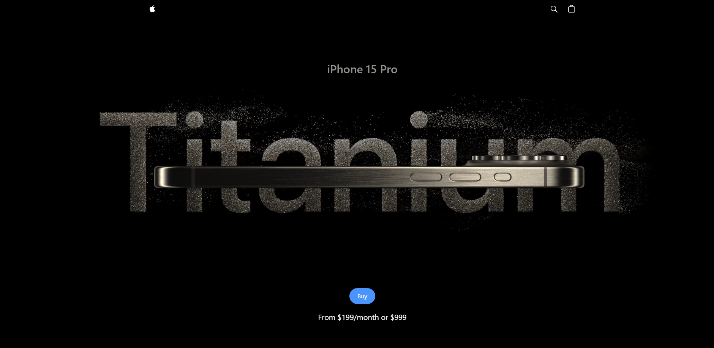

# iPhone 15 Pro

This project is a dynamic clone of the Apple iPhone 15 Pro website, implemented using React and styled with Tailwind CSS. It showcases advanced front-end development techniques including 3D rendering with Three.js and rich animations using GSAP. The site is built and optimized with Vite for faster development and deployment.

## Features

- **React Framework:** Leverages React for efficient UI development with reusable components.
- **Tailwind CSS:** Utilizes Tailwind for rapid and responsive styling without leaving your markup.
- **Three.js for 3D Rendering:** Provides interactive 3D views of the iPhone 15 Pro, offering users a detailed and immersive look at the product.
- **GSAP Animations:** Implements GSAP for smooth, high-performance animations that enhance user interaction.
- **Vite Build Tool:** Uses Vite for an incredibly fast development experience and optimized production builds.
- **Responsive and Interactive Design:** Ensures the site is functional and beautiful on devices of all sizes, with interactive elements that engage users.

## Technologies Used

- React
- Tailwind CSS
- GSAP (GreenSock Animation Platform)
- Three.js
- Vite
- HTML5
- CSS3
- JavaScript

## Getting Started

Follow these instructions to get a copy of the project up and running on your local machine for development and testing purposes.

### Prerequisites

You will need the following tools installed on your system:

- Node.js and npm
- Git

